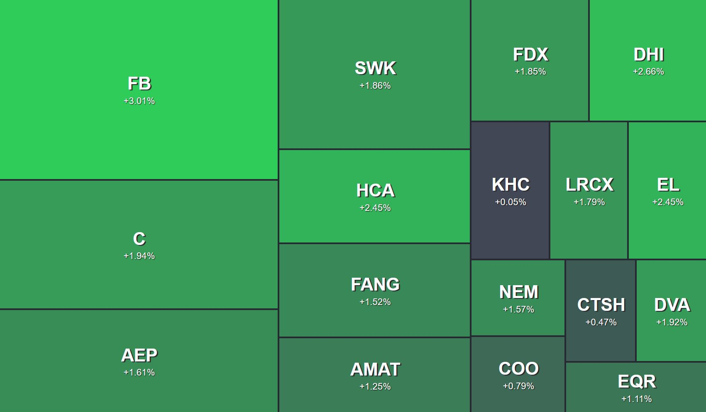

# heatmap
Stock market price activity heatmap. But really just an excuse to learn Golang for no reason

## Mixed Day

## Good Day

## Bad Day

### Prerequisites
1. Go
2. Polygon.io API key stored as `POLYGON_API_KEY` in `.env`
3. The imports in `getportfolio.go`

### Usage
1. go run `getportfolio.go`
2. python3 -m http.server
3. Navigate to `http://127.0.0.1:8000/` in a browser window

### Notes
I did very little testing on this but I imagine it works best with 15-30 stock tickers.  You can modify `myport.csv` to reflect stock tickers followed by the number of shares you own like this:
* msft,7  
* NVDA,13  

Due to Polygon.io API limitations, the script will sleep 12 seconds in between API calls if you have more than 5 items in `myport.csv`  

And lastly, the stocks mentioned anywhere in this project were randomly chosen and some of the data falsified for demonstrative purposes.